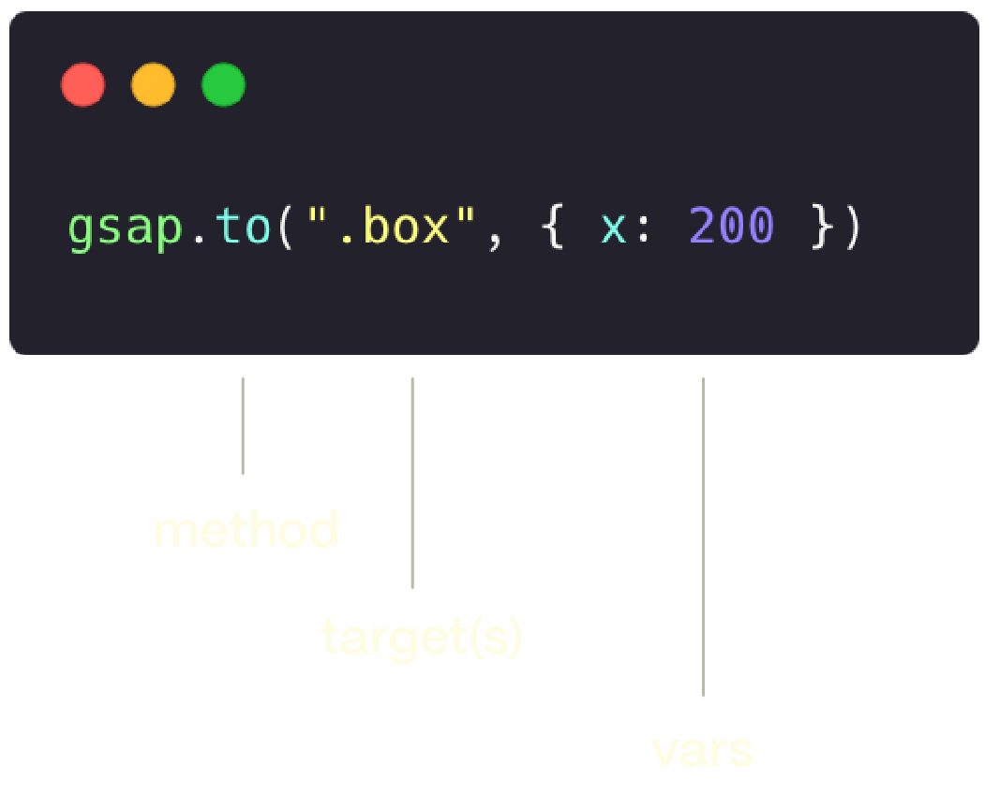

# 入门

欢迎！在本文中，我们将介绍 GSAP 的核心基础知识并为一些 HTML 元素制作动画。🥳

如果这不是您的最终目标，请不要担心。无论您打算制作什么动画，使用哪个框架 - 此处介绍的技术和原则都将为您服务。

## 创建动画。

让我们首先使用 “box” 类为 HTML 元素制作动画。

```js
gsap.to('.box', { x: 200 })
```

像这样的单个动画称为 'tween' 这个补间说“嘿 GSAP，用 '.box' 类将元素动画化为 200px 的 x（如 transform： translateX（200px））”。


